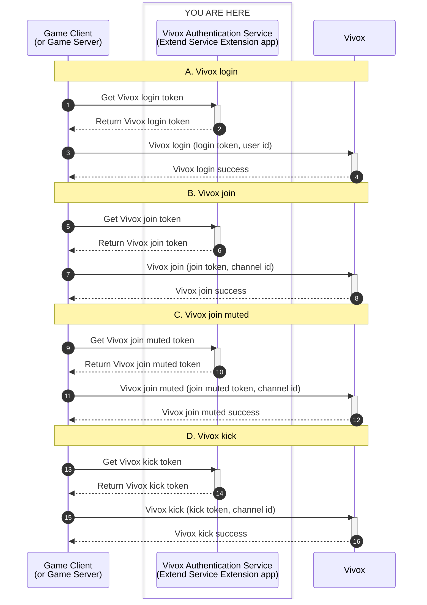
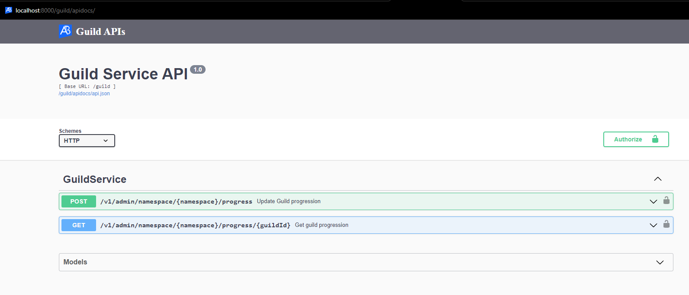
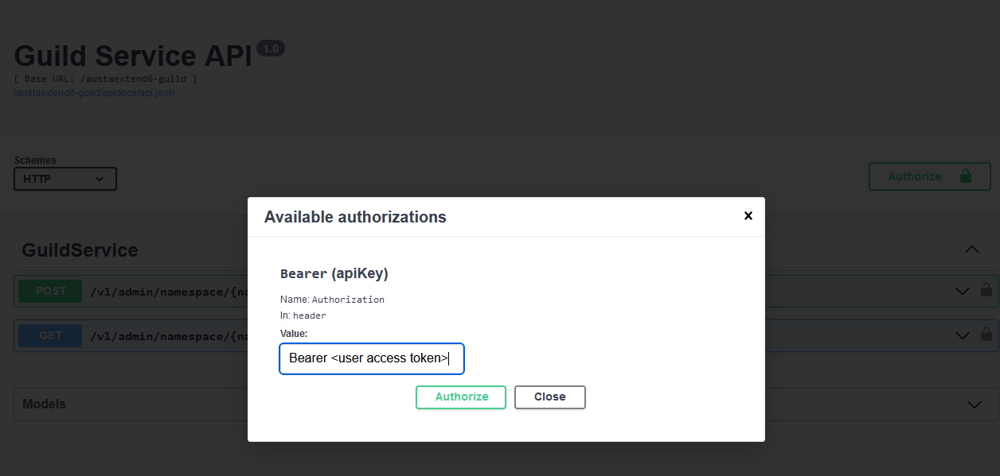

# extend-vivox-authorization-service-python

A Vivox authentication service is essential for integrating AccelByte Gaming Services (AGS), Vivox, and game clients. It generates the signed Vivox token that game clients need to interact with Vivox. This token is valid for 90 seconds, so game clients must regularly call the service to obtain a new token.



## Overview

This repository provides a project template for an `Vivox Authorization Service` Extend Service Extension app written in `Python`. It includes a ready to use service to generate Vivox access token. This web service created using a stack that includes a `gRPC Server` and the [gRPC Gateway](https://github.com/grpc-ecosystem/grpc-gateway?tab=readme-ov-file#about). Additionally, it comes with built-in instrumentation for observability, ensuring that metrics, traces, and logs are available upon deployment.

You can clone this repository to modify and develop your own 
`Vivox Authorization Service` Extend app. Simply modify this project by defining your 
endpoints in `service.proto` file and implementing the handlers for those 
endpoints.

If you need to customize this app, please refer to our [Extend Service Extension](https://docs.accelbyte.io/gaming-services/services/extend/service-extension/) documentation.

## Prerequisites

1. Windows 11 WSL2 or Linux Ubuntu 22.04 or macOS 14+ with the following tools installed:

   a. Bash

      - On Windows WSL2 or Linux Ubuntu:

         ```
         bash --version

         GNU bash, version 5.1.16(1)-release (x86_64-pc-linux-gnu)
         ...
         ```

      - On macOS:

         ```
         bash --version

         GNU bash, version 3.2.57(1)-release (arm64-apple-darwin23)
         ...
         ```

   b. Make

      - On Windows WSL2 or Linux Ubuntu:

         To install from the Ubuntu repository, run `sudo apt update && sudo apt install make`.

         ```
         make --version

         GNU Make 4.3
         ...
         ```

      - On macOS:

         ```
         make --version

         GNU Make 3.81
         ...
         ```

   c. Docker (Docker Desktop 4.30+/Docker Engine v23.0+)
   
      - On Linux Ubuntu:

         1. To install from the Ubuntu repository, run `sudo apt update && sudo apt install docker.io docker-buildx docker-compose-v2`.
         2. Add your user to the `docker` group: `sudo usermod -aG docker $USER`.
         3. Log out and log back in to allow the changes to take effect.

      - On Windows or macOS:

         Follow Docker's documentation on installing the Docker Desktop on [Windows](https://docs.docker.com/desktop/install/windows-install/) or [macOS](https://docs.docker.com/desktop/install/mac-install/).

         ```
         docker version

         ...
         Server: Docker Desktop
            Engine:
            Version:          24.0.5
         ...
         ```

   d. Python 3.10

      - On Linux Ubuntu:

         To install from the Ubuntu repository, run `sudo apt update && sudo apt install python3 python3-venv`.

      - On Windows or macOS:

         Use the available installer [here](https://www.python.org/downloads/).

         ```
         python3 --version

         Python 3.10.12
         ```

   e. [Postman](https://www.postman.com/)

      - Use binary available [here](https://www.postman.com/downloads/)

   f. [extend-helper-cli](https://github.com/AccelByte/extend-helper-cli)

      - Use the available binary from [extend-helper-cli](https://github.com/AccelByte/extend-helper-cli/releases).

   > :exclamation: In macOS, you may use [Homebrew](https://brew.sh/) to easily install some of the tools above.

2. Access to AGS environment.

   a. Base URL:

      - Sample URL for AGS Shared Cloud customers: `https://spaceshooter.prod.gamingservices.accelbyte.io`
      - Sample URL for AGS Private Cloud customers:  `https://dev.accelbyte.io`

   b. [Create a Game Namespace](https://docs.accelbyte.io/gaming-services/services/access/reference/namespaces/manage-your-namespaces/) if you don't have one yet. Keep the `Namespace ID`. Make sure this namespace is in active status.

   c. [Create an OAuth Client](https://docs.accelbyte.io/gaming-services/services/access/authorization/manage-access-control-for-applications/#create-an-iam-client) 
      with confidential client type with the following permissions. Keep the 
      `Client ID` and `Client Secret`.

      - For AGS Private Cloud customers:
         - `ADMIN:ROLE [READ]` to validate access token and permissions
         - `ADMIN:NAMESPACE:{namespace}:NAMESPACE [READ]` to validate access namespace        
      - For AGS Shared Cloud customers:
         - IAM -> Roles (Read)
         - Basic -> Namespace (Read)

3. Your Vivox configuration.
   - Vivox application-specific issuer name
   - Vivox domain name
   - Vivox signing key

## Setup

To be able to run this app, you will need to follow these setup steps.

1. Create a docker compose `.env` file by copying the content of 
   [.env.template](.env.template) file.

   > :warning: **The host OS environment variables have higher precedence 
   compared to `.env` file variables**: If the variables in `.env` file do not 
   seem to take effect properly, check if there are host OS environment 
   variables with the same name. See documentation about 
   [docker compose environment variables precedence](https://docs.docker.com/compose/how-tos/environment-variables/envvars-precedence/) 
   for more details.

2. Fill in the required environment variables in `.env` file as shown below.

   ```
   AB_BASE_URL='http://test.accelbyte.io'       # Your environment's domain Base URL
   AB_CLIENT_ID='xxxxxxxxxx'                    # Client ID from the Prerequisites section
   AB_CLIENT_SECRET='xxxxxxxxxx'                # Client Secret from the Prerequisites section
   AB_NAMESPACE='xxxxxxxxxx'                    # Namespace ID from the Prerequisites section
   PLUGIN_GRPC_SERVER_AUTH_ENABLED=true         # Enable or disable access token and permission validation
   BASE_PATH='/vivoxauth'                       # The base path used for the app
   VIVOX_ISSUER='xxxx'                          # Replace with your Vivox application-specific issuer name
   VIVOX_DOMAIN='tla.vivox.com'                 # Replace with Vivox domain default to `tla.vivox.com`
   VIVOX_SIGNING_KEY='xxxxxxx'                  # Replace with your Vivox signing key
   ```
 
   > :exclamation: **In this app, PLUGIN_GRPC_SERVER_AUTH_ENABLED is `true` by default**: If it is set to `false`, the endpoint `permission.action` and `permission.resource`  validation will be disabled and the endpoint can be accessed without a valid access token. This option is provided for development purpose only.

## Building

To build this app, use the following command.

```shell
make build
```

The build output will be available in `.output` directory.

## Running

To (build and) run this app in a container, use the following command.

```shell
docker compose up --build
```

## Testing

### Unit Test

The unit test for the example included in this project is available in `src/AccelByte.Extend.Vivox.Authentication.Tests`.
Run this command to execute unit test.

```shell
make test
```

### Test in Local Development Environment

This app can be tested locally through the Swagger UI.

1. Run this app by using the command below.

   ```shell
   docker compose up --build
   ```

2. If **PLUGIN_GRPC_SERVER_AUTH_ENABLED** is `true`: Get an access token to 
   be able to access the REST API service. 
   
   To get a user access access token, you can use
   [get-access-token.postman_collection.json](demo/get-access-token.postman_collection.json).
   Import the Postman collection to your Postman workspace and create a 
   Postman environment containing the following variables.

   - `AB_BASE_URL` For example, https://test.accelbyte.io
   - `AB_CLIENT_ID` A confidential IAM OAuth client ID
   - `AB_CLIENT_SECRET` The corresponding confidential IAM OAuth client secret
   - `AB_USERNAME` The username or e-mail of the user
   - `AB_PASSWORD` The corresponding user password

   To get the user access token, open the `POST get-user-access-token` request in this 
   collection and click `Send`. If successful, you will get a `200 OK` response and 
   the user access token will be available in access_token property in the response 
   body. In the example below, the user token is `eyJhbGciOi...`.

   ```json
   {
      "access_token": "eyJhbGciOi...",
      ...
   }
   ```

   > :info: Make sure the user has a role which contains this permission: 
   `ADMIN:NAMESPACE:{namespace}:VIVOX:TOKEN [READ]`.

3. The REST API service can then be tested by opening Swagger UI at 
   `http://localhost:8000/vivoxauth/apidocs/`. Use this to create an API request 
   to try the endpoints.
   
   > :info: Depending on the envar you set for `BASE_PATH`, the service will 
   have different service URL. This how it's the formatted 
   `http://localhost:8000/<base_path>`

   

   To authorize Swagger UI, click on "Authorize" button on right side.

   

   Popup will show, input "Bearer <user access token>" in `Value` field for 
   `Bearer (apiKey)`. Then click "Authorize" to save the user's access token.

### Test Observability

To be able to see the how the observability works in this template project in
local development environment, there are few things that need be setup before 
performing test.

1. Uncomment loki logging driver in [docker-compose.yaml](docker-compose.yaml)

   ```
    # logging:
    #   driver: loki
    #   options:
    #     loki-url: http://host.docker.internal:3100/loki/api/v1/push
    #     mode: non-blocking
    #     max-buffer-size: 4m
    #     loki-retries: "3"
   ```

   > :warning: **Make sure to install docker loki plugin beforehand**: Otherwise,
   this app will not be able to run. This is required so that container 
   logs can flow to the `loki` service within `grpc-plugin-dependencies` stack. 
   Use this command to install docker loki plugin: 
   `docker plugin install grafana/loki-docker-driver:latest --alias loki --grant-all-permissions`.

2. Clone and run [grpc-plugin-dependencies](https://github.com/AccelByte/grpc-plugin-dependencies) stack alongside this app. After this, Grafana 
will be accessible at http://localhost:3000.

   ```
   git clone https://github.com/AccelByte/grpc-plugin-dependencies.git
   cd grpc-plugin-dependencies
   docker compose up
   ```

   > :exclamation: More information about [grpc-plugin-dependencies](https://github.com/AccelByte/grpc-plugin-dependencies) 
   is available [here](https://github.com/AccelByte/grpc-plugin-dependencies/blob/main/README.md).

3. Perform testing. For example, by following [Test in Local Development Environment](#test-in-local-development-environment).

## Deploying

After completing testing, the next step is to deploy your app to `AccelByte Gaming Services`.

1. **Create an Extend Service Extension app**

   If you do not already have one, create a new [Extend Service Extension App](https://docs.accelbyte.io/gaming-services/services/extend/service-extension/sample-use-cases/vivox-authentication-service/#create-the-extend-app).

   On the **App Detail** page, take note of the following values.
   - `Namespace`
   - `App Name`

2. **Build and Push the Container Image**

   Use [extend-helper-cli](https://github.com/AccelByte/extend-helper-cli) to build and upload the container image.

   ```
   extend-helper-cli image-upload --login --namespace <namespace> --app <app-name> --image-tag v0.0.1
   ```

   > :warning: Run this command from your project directory. If you are in a different directory, add the `--work-dir <project-dir>` option to specify the correct path.

3. **Deploy the Image**
   
   On the **App Detail** page:
   - Click **Image Version History**
   - Select the image you just pushed
   - Click **Deploy Image**
